# Spotify Playlist Recommender
## Table of Contents
1. [The task](#the-task)
2. [The dataset](#the-dataset)
3. [Metrics](#metrics)
4. [Proposed Solutions](#proposed-solutions)
5. [EDA](#eda)
6. [Timeline](#timeline)

## The task
The goal of the challenge is to develop a system for the task of automatic playlist continuation. Given a set of playlist features, participants’ systems shall generate a list of recommended tracks that can be added to that playlist, thereby ‘continuing’ the playlist. We define the task formally as follows:


__Input__

A user-created playlist, represented by:
1. Playlist metadata
2. K seed tracks: a list of the K tracks in the playlist, where K can equal 0, 1, 5, 10, 25, or 100.

__Output__

- A list of 500 recommended candidate tracks, ordered by relevance in decreasing order.

Note that the system should also be able to cope with playlists for which no initial seed tracks are given. To assess the performance of a submission, the output track predictions are compared to the ground truth tracks (“reference set”) from the original playlist.

## The dataset
The Million Playlist Dataset (MPD) contains 1,000,000 playlists created by users on the Spotify platform. It can be used by researchers interested in exploring how to improve the music listening experience.

The MPD contains a million user-generated playlists. These playlists were created during the period of January 2010 through October 2017. Each playlist in the MPD contains a playlist title, the track list (including track metadata) editing information (last edit time, number of playlist edits) and other miscellaneous information about the playlist.

__Detailed description__

The Million Playlist Dataset consists of 1,000 slice files. These files have the naming convention of:

mpd.slice._STARTING\_PLAYLIST\_ID\_-\_ENDING\_PLAYLIST\_ID_.json

For example, the first 1,000 playlists in the MPD are in a file called
`mpd.slice.0-999.json` and the last 1,000 playlists are in a file called
`mpd.slice.999000-999999.json`.

Each slice file is a JSON dictionary with two fields:
*info* and *playlists*.


### `info` Field
The info field is a dictionary that contains general information about the particular slice:

   * **slice** - the range of slices that in in this particular file - such as 0-999
   * ***version*** -  - the current version of the MPD (which should be v1)
   * ***generated_on*** - a timestamp indicating when the slice was generated.

### `playlists` field
This is an array that typically contains 1,000 playlists. Each playlist is a dictionary that contains the following fields:


* ***pid*** - integer - playlist id - the MPD ID of this playlist. This is an integer between 0 and 999,999.
* ***name*** - string - the name of the playlist
* ***description*** - optional string - if present, the description given to the playlist.  Note that user-provided playlist descrptions are a relatively new feature of Spotify, so most playlists do not have descriptions.
* ***modified_at*** - seconds - timestamp (in seconds since the epoch) when this playlist was last updated. Times are rounded to midnight GMT of the date when the playlist was last updated.
* ***num_artists*** - the total number of unique artists for the tracks in the playlist.
* ***num_albums*** - the number of unique albums for the tracks in the playlist
* ***num_tracks*** - the number of tracks in the playlist
* ***num_followers*** - the number of followers this playlist had at the time the MPD was created. (Note that the follower count does not including the playlist creator)
* ***num_edits*** - the number of separate editing sessions. Tracks added in a two hour window are considered to be added in a single editing session.
* ***duration_ms*** - the total duration of all the tracks in the playlist (in milliseconds)
* ***collaborative*** -  boolean - if true, the playlist is a collaborative playlist. Multiple users may contribute tracks to a collaborative playlist.
* ***tracks*** - an array of information about each track in the playlist. Each element in the array is a dictionary with the following fields:
   * ***track_name*** - the name of the track
   * ***track_uri*** - the Spotify URI of the track
   * ***album_name*** - the name of the track's album
   * ***album_uri*** - the Spotify URI of the album
   * ***artist_name*** - the name of the track's primary artist
   * ***artist_uri*** - the Spotify URI of track's primary artist
   * ***duration_ms*** - the duration of the track in milliseconds
   * ***pos*** - the position of the track in the playlist (zero-based)

Here's an example of a typical playlist entry:

        {
            "name": "musical",
            "collaborative": "false",
            "pid": 5,
            "modified_at": 1493424000,
            "num_albums": 7,
            "num_tracks": 12,
            "num_followers": 1,
            "num_edits": 2,
            "duration_ms": 2657366,
            "num_artists": 6,
            "tracks": [
                {
                    "pos": 0,
                    "artist_name": "Degiheugi",
                    "track_uri": "spotify:track:7vqa3sDmtEaVJ2gcvxtRID",
                    "artist_uri": "spotify:artist:3V2paBXEoZIAhfZRJmo2jL",
                    "track_name": "Finalement",
                    "album_uri": "spotify:album:2KrRMJ9z7Xjoz1Az4O6UML",
                    "duration_ms": 166264,
                    "album_name": "Dancing Chords and Fireflies"
                },
                {
                    "pos": 1,
                    "artist_name": "Degiheugi",
                    "track_uri": "spotify:track:23EOmJivOZ88WJPUbIPjh6",
                    "artist_uri": "spotify:artist:3V2paBXEoZIAhfZRJmo2jL",
                    "track_name": "Betty",
                    "album_uri": "spotify:album:3lUSlvjUoHNA8IkNTqURqd",
                    "duration_ms": 235534,
                    "album_name": "Endless Smile"
                },
                {
                    "pos": 2,
                    "artist_name": "Degiheugi",
                    "track_uri": "spotify:track:1vaffTCJxkyqeJY7zF9a55",
                    "artist_uri": "spotify:artist:3V2paBXEoZIAhfZRJmo2jL",
                    "track_name": "Some Beat in My Head",
                    "album_uri": "spotify:album:2KrRMJ9z7Xjoz1Az4O6UML",
                    "duration_ms": 268050,
                    "album_name": "Dancing Chords and Fireflies"
                },
                // 8 tracks omitted
                {
                    "pos": 11,
                    "artist_name": "Mo' Horizons",
                    "track_uri": "spotify:track:7iwx00eBzeSSSy6xfESyWN",
                    "artist_uri": "spotify:artist:3tuX54dqgS8LsGUvNzgrpP",
                    "track_name": "Fever 99\u00b0",
                    "album_uri": "spotify:album:2Fg1t2tyOSGWkVYHlFfXVf",
                    "duration_ms": 364320,
                    "album_name": "Come Touch The Sun"
                }
            ],

        }


## Challenge Set
I build my own challenge Set based on criteria of official one but with some modification

__Test Set Format__

The challenge set consists of a single JSON dictionary with three fields:

- __date__ - the date the challenge set was generated. This should be "2018-01-16 08:47:28.198015"
- __version__ - the version of the challenge set. This should be "v1"
- __playlists__ - an array of 10,000 incomplete playlists. Each element in this array contains the following fields:
  - __pid__ - the playlist ID
  - __name__ - (optional) - the name of the playlist. For some challenge playlists, the name will be missing.
  - __num_holdouts__ - the number of tracks that have been omitted from the playlist
  - __tracks__ - a (possibly empty) array of tracks that are in the playlist. Each element of this array contains the following fields:
    - __pos__ - the position of the track in the playlist (zero offset)
    - __track_name__ - the name of the track
    - __track_uri__ - the Spotify URI of the track
    - __artist_name__ - the name of the primary artist of the track
    - __artist_uri__ - the Spotify URI of the primary artist of the track
    - __album_name__ - the name of the album that the track is on
    - __album_uri__ -- the Spotify URI of the album that the track is on
    - __duration_ms__ - the duration of the track in milliseconds
    - __num_samples__ the number of tracks included in the playlist
    - __num_tracks__ - the total number of tracks in the playlist.

__How to build Test Set__

Dataset contains PID from 0 to 999,999 (1 mil playlists), with M unique Tracks

In order to replicate competition's test set, we remove some playlists from original playlists such that

- All tracks in the challenge set appear in the MPD
- All holdout tracks appear in the MPD

The test set contains 10 difference challenges, each challenge contains 1000 playlists sampled from MPD:

1. Predict tracks for a playlist given its title and the first 5 tracks
2. Predict tracks for a playlist given its title and the first 10 tracks
3. Predict tracks for a playlist given its title and the first 25 tracks
4. Predict tracks for a playlist given its title and 25 random tracks
5. Predict tracks for a playlist given its title and the first 50 tracks
6. Predict tracks for a playlist given its title and 50 random tracks
7. Predict tracks for a playlist given its title and the first 100 tracks
8. Predict tracks for a playlist given its title and 100 random tracks
9. Predict tracks for a playlist given its title and the first 200 tracks
10. Predict tracks for a playlist given its title and 200 random tracks


__How to build train Set__

Train set will be the original set subtracts tracks in test sets


## Metrics
Submissions will be evaluated using the following metrics. All metrics will be evaluated at both the track level (exact track must match) and the artist level (any track by that artist is a match). In the following, we denote the ground truth set of tracks by __G__, and the ordered list of recommended tracks by __R__. The size of a set or list is denoted by __| ⋅ |__, and we use from:to-subscripts to index a list. In the case of ties on individual metrics, earlier submissions are ranked higher.

__R-precision__

R-precision is the number of retrieved relevant tracks divided by the number of known relevant tracks (i.e., the number of withheld tracks):

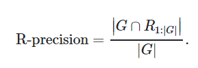

The metric is averaged across all playlists in the challenge set. This metric rewards total number of retrieved relevant tracks (regardless of order).

__Normalized discounted cumulative gain (NDCG)__

Discounted cumulative gain (DCG) measures the ranking quality of the recommended tracks, increasing when relevant tracks are placed higher in the list. Normalized DCG (NDCG) is determined by calculating the DCG and dividing it by the ideal DCG in which the recommended tracks are perfectly ranked:

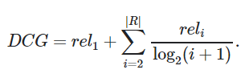

The ideal DCG or IDCG is, on our case, equal to:

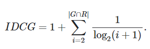

If the size of the set intersection of G and R, is empty, then the DCG is equal to 0. The NDCG metric is now calculated as:

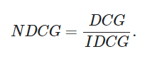

__Recommended Songs clicks__

Recommended Songs is a Spotify feature that, given a set of tracks in a playlist, recommends 10 tracks to add to the playlist. The list can be refreshed to produce 10 more tracks. Recommended Songs clicks is the number of refreshes needed before a relevant track is encountered. It is calculated as follows:


If the metric does not exist (i.e. if there is no relevant track in R), a value of 51 is picked (which is 1 + the maximum number of clicks possible).

__Rank aggregation__

Final rankings will be computed by using the [Borda Count](https://en.wikipedia.org/wiki/Borda_count)  election strategy. For each of the rankings of p participants according to R-precision, NDCG, and Recommended Songs clicks, the top ranked system receives p points, the second system receives p-1 points, and so on. The participant with the most total points wins. In the case of ties, we use top-down comparison: compare the number of 1st place positions between the systems, then 2nd place positions, and so on.

## Proposed Solutions

### Background of Recommender:
A recommender system would suggest relevant products such as books, movies, songs or friends for customer. There are two basic types of recommenders. One is called __content-based filtering__ and the other is __collaborative filtering__. Generally speaking, content-based systems are simpler but come up with less interesting recommendations. Collaborative systems can get very complicated and unwieldy and require a lot of user-generated data, but they’re the state of the art.

__Content-based filtering__: Some experts or customers will manually investigate products and put them label them to various category / attributes. Once we have all features, we can calculate similarity between each item to other and retrieve relevant items.

__Collaborative filtering (CF)__: In contrast of content-based filtering, collaborative filtering does not require manual labels. The system would look at users who have similar taste / behavior to make product suggestion. In collaborative filtering, we also have two types, one is memory-based and other is model-based. While memory-based CF needs to construct a large matrix of user-item to calculate similarity, model-based CF requires machine learning algorithms such as clustering, matrix factorization and deep learning.


In __Memory-based filtering__, we also have two types, one is User-Item CF and other is Item-Item CF.
- User-Item CF: take a particular person, find people who are similar to that person based on similar ratings, and recommend items those similar people liked. “Customers who are similar to you also liked …”
- Item-Item CF: Item-item filtering will take a particular item, find people who liked that item, and find other items that those people (or people similar to them) also liked (in common?). It takes items and outputs other items as recommendations. “Customers who liked this item also liked …”
- In short User-Item CF is “Customers who are similar to you also liked …” and Item-Item CF is “Customers who liked this item also liked …”
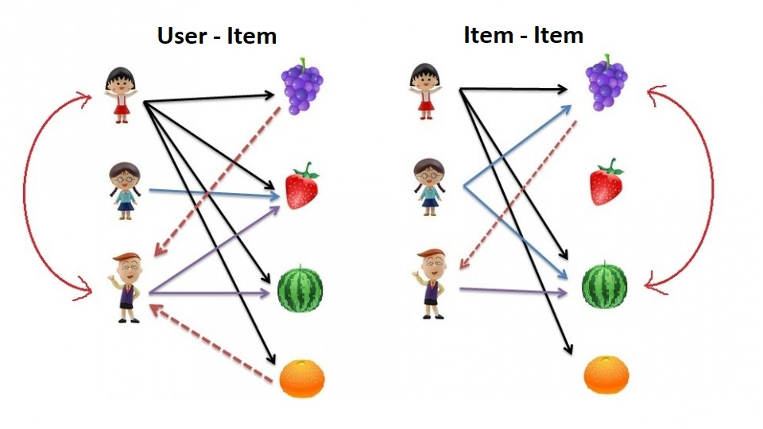

Memory-based algorithms are easy to implement and produce reasonable prediction quality. The drawback of memory-based CF is that it doesn't scale to real-world scenarios and doesn't address the well-known cold-start problem, that is when new user or new item enters the system. Model-based CF methods are scalable and can deal with higher sparsity level than memory-based models, but also suffer when new users or items that don't have any ratings enter the system.

In __Model-based filtering__, In model-based CF, we all start with Matric factorization. Matrix factorization is widely used for recommender systems where it can deal better with scalability and sparsity than Memory-based CF.

The goal of Matrix factorization is to learn the latent preferences of users and the latent attributes of items from known ratings (learn features that describe the characteristics of ratings) to then predict the unknown ratings through the dot product of the latent features of users and items. When you have a very sparse matrix, with a lot of dimensions, by doing matrix factorization you can restructure the user-item matrix into low-rank structure, and you can represent the matrix by the multiplication of two low-rank matrices, where the rows contain the latent vector. You fit this matrix to approximate your original matrix, as closely as possible, by multiplying the low-rank matrices together, which fills in the entries missing in the original matrix.

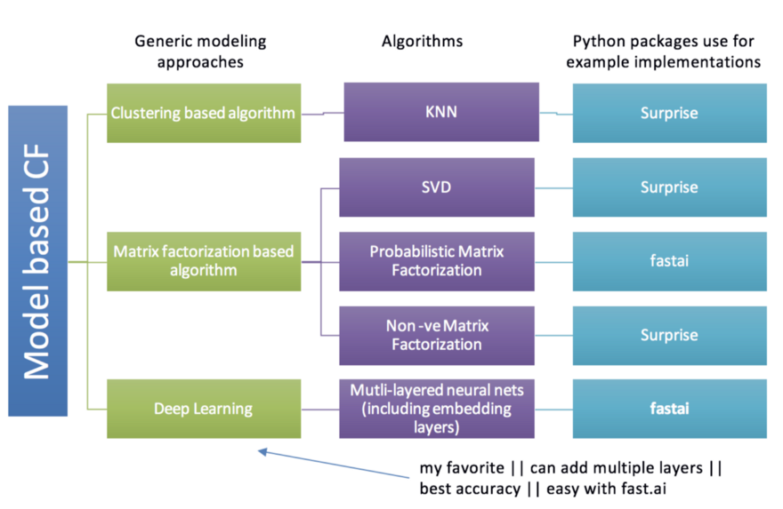

### Playlist Recommender:

For our problem, we treat "user" as "playlist" and "item" as "song". Because the dataset don't provide much information about each song so we won't use content-based filtering. Therefore we would only focus on Collaborative Filtering.

### Memory Based
In __memory-based__, we following the procedure
1. Construct playlist-song matrix


"1" means that song is included in the playlist and "0" otherwise. For example, playlist 1 contains song 2 and song 3, song 2 also includes in playlist 2.

2. First we split the data into training and testing set. Refer to #ChallengeSet for how to build test set.

3. Calculate the similarity between song-song or playlist-playlist. In playlist-playlist similarity, we take each row as a vector while in song-song similarity we take column as a vector.

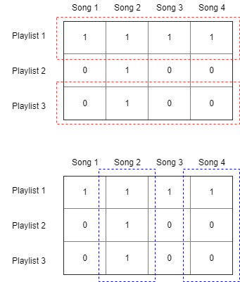

__similarity metrics:__
- Cosine

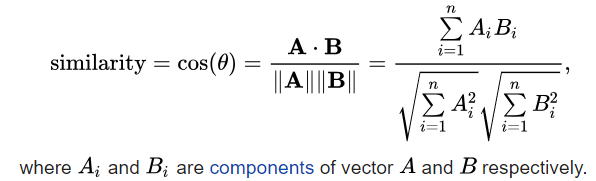

- Euclidean

__Formula here__

- Pearson Correlation

__Formula here__

4. Based on the similarity matrix and, we make the prediction on the testing set.

__Note that__ Because user-based CF cannot deal with users (playlist) who never appear in the history, we will only use item-based CF (songs) =>> __WRONG__ we will __incorporate test set to train set__ -> build sim matrix and follow next steps


For playlist-playlist, we predict that a playlist __p__ contains song __s__ is given by the weighted sum of all other playlists' containing for song __s__ where the weighting is the cosine similarity between the each playlist and the input playlist __p__. Then normalizing the result.


---


With song-song, we simply replace similarity matrix of playlists by that of songs.


Given N songs in a playlist, how to predict next K songs
- Playlist-based (like user-based)

```
- Build similarity matrix between playlists (cosine, euclidean, Pearson correlation)
- For each playlist Px:
    n = 1
    While total_track is not 500:
      Find n-th most relevant playlist of Px, called Pr
      Add K (or all) songs in Pr to Px
      Increment n by 1

```

- Song-based (like item-based) -> this is weird (why you don't just use KNN at the very first place)

(Our space is the space of similarity)
```
- Build similarity matrix between songs (cosine, euclidean, Pearson Correlation)
- For each playlist Px:
    Compute "cluster center" by averaging all similarities
    Get K = 500 nearest neighbor and add to existing songs
```

What the winner did, they divide the problem into 2 stages

- Stage 1: Build a CF to retrieve list of candidates
- Stage 2: Build some ML model to re-rank order of candidates


5. Evaluate based on 4 metrics

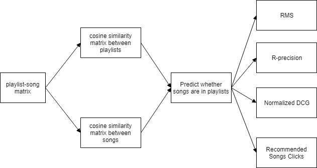

### Model Based
Matrix factorization can be done with orthogonal factorization (SVD), probabilistic factorization (PMF) or Non-Negative factorization (NMF).

__Singular Value Decomposition (SVD)__
Collaborative Filtering can be formulated by approximating a matrix __X__ by using singular value decomposition. The winning team at the Netflix Prize competition used SVD matrix factorization models to produce product recommendations, for more information I recommend to read articles: Netflix Recommendations: Beyond the 5 stars and Netflix Prize and SVD. The general equation can be expressed as follows: __X = U × S × V_transpose__

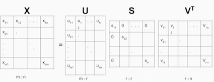

__Deep Learning__
Once we have latent feature vectors of playlist and songs, we can feed them to a Deep Learning model or any Machine Learning model to predict results.

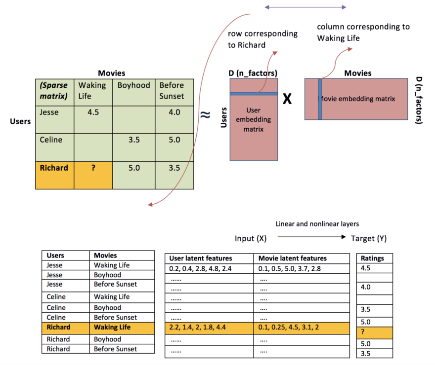


### Blending / Combine / Hybrid Model
- Combine Memory-Based and Model-based

### Challenge:

1. Single PC maybe cannot handle this dataset.


### EDA:

- Number of:
  - playlists: 1000000
  - Tracks: 66346428
  - Unique tracks: 2262292
  - Unique albums: 734684
  - Unique Titles: 92944

- Distribution of: Playlist length, Number of Albums / Playlist, Number of Artist / Playlist, Number of edits / Playlist, Number of Followers / Playlist, Number of Tracks / Playlist

  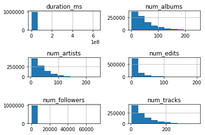

  As we can see all distributions are left-skewed which means if we are looking for average value, we should go for "Median" not "Mean"

  - Median of playlist length:  11422438.0
  - Median of number of albums in each playlist:  37.0
  - Median of number of artists in each playlist:  29.0
  - Median of number of edits in each playlist:  29.0
  - Median of number of followers in each playlist:  1.0
  - Median of number of tracks in each playlist:  49.0

- Top 20 Songs in Sporify playlists

  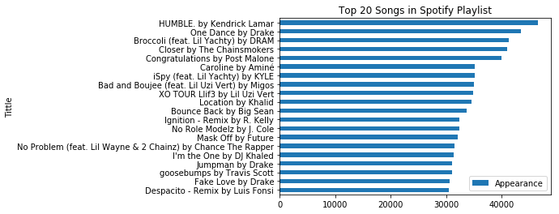

- Top 20 Artist in Spotify Playlists

  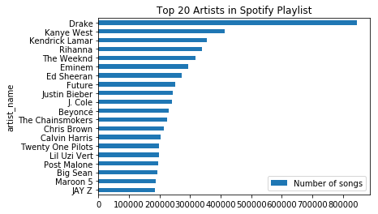


### Preliminary Result

1. Description for small Dataset.
  - df_train: Columns = [pid,tid,pos], size = 1mil playlists with 10000 incomplete playlists
  - df_test: Columns = [pid,tid,pos], size = 10000 complete playlists
2. File

  - buildChallengeSet: replicate the challenge set
  - buildPLaylistSongMatrix: export playlist-song matrix in format [pid, list(tid), list(pos)]
  - helper: helping function
  - evalution:
  - baseline

3. Result of item-item / user-item based

|Method| Parameter|R-precision|NDCG|Song Click|
|:----:|:--------:|:---------:|:---:|:-------:|
|Playlist-based||0.5965 |0.7798|0.0|
|Song-based|||||
|Word2Vec + Song-based|100-200-300 dimension|0.0030|0.004|10.35|
|Word2Vec + Playlist-based|min_fre = 3, dimension 50| 0.0171|0.015 |8.086|
|Word2Vec + Playlist-based|min_fre = 3, dimension 100| 0.0190|0.0172 |7.805|
|FP Growth|||||


|Method| Parameter|  RMS |R-precision|
|:----:|:--------:|:----:|:---------:|
|Playlist-based CF||||
|Song-based CF||||
|Matrix Factorization||||


3. Conclusion

## Progress:

- Finish Word2Vec models in Spark -> work in word2vec space.

Vectors.sparse()

- Try data structure Vector Sparse -> efficient way to deal with sparse vectors
- If Vector Sparse works -> open up opportunities for other Matrix Factorization algorithms
-

## Timeline:

- Week 0
  - [x] Project Proposal
- Week 1
  - [x] Work on some tutorials of CF from Movie Data.
  - [x] Complete Section 16: __Data Science at Scale__, focus on __Spark and PySpark__
- Week 2
  - [x] Parse JSON to Dataframe and save to disk for later usage.
  - [x] Take a small subset of data and do the same. Start with Memory-based model (Item-item, and user-item) -> Not enough Memory even for small data
  - [x] Apply what you've learned to do some basic EDA of data.
  - [x] Setup Spark to local Machine / server.
  - [x] Read solutions of RecSys of winners.   https://github.com/VasiliyRubtsov/recsys2018/blob/master/json_to_dataframe.ipynb

- Week 3
  - [x] Build a test set
  - [x] Configure to connect Spyder to Server
  - [x] Implement function to compute the metrics
  - [x] Build a giant table of user-item -> DONT DO THIS -> ACTUALLY I DID IT

- Week
  - [x] Word2vec model for song-based model in Spark
  - [x] Word2vec model for playlist-based model in Spark
  - [ ] Implement user-based CF -> Need to test
  - [ ] Implement item-based CF -> Need to test
  - [ ] NMF with Sk-learn with scipy.sparse vector
  - [ ] ALS with Vectos.sparse in Spark

- Week:


- Week
  - [ ] Compare model with various Metrics
  - [ ] Tune model and finalize the results.
  - [ ] Finish the report.

## Reference:

1. [Many Types of Recommender Systems](https://blogs.gartner.com/martin-kihn/how-to-build-a-recommender-system-in-python/)
2. [Playlist Recommender](https://medium.com/s/story/spotifys-discover-weekly-how-machine-learning-finds-your-new-music-19a41ab76efe)
3. [Millions song dataset](https://www.kaggle.com/c/msdchallenge)
4. [Amazon Recommendations Item-to-Item Collaborative Filtering](http://www.cs.umd.edu/~samir/498/Amazon-Recommendations.pdf)
5. [Collaborative Filterring at Spottify](https://www.slideshare.net/erikbern/collaborative-filtering-at-spotify-16182818/62)
6. [Implementing CF in Python](https://cambridgespark.com/content/tutorials/implementing-your-own-recommender-systems-in-Python/index.html)
7. [Implementing CF in Python with Last.fm dataset](http://www.salemmarafi.com/code/collaborative-filtering-with-python/)
8. [Theory and implementation of CF -must read](https://towardsdatascience.com/various-implementations-of-collaborative-filtering-100385c6dfe0)
9. [must read](http://blog.ethanrosenthal.com/2015/11/02/intro-to-collaborative-filtering/)
10. [Spark API collaborative filtering](https://spark.apache.org/docs/latest/mllib-collaborative-filtering.html)
11. [Large-Scale Parallel Collaborative Filtering for the Netflix Prize](https://link.springer.com/chapter/10.1007%2F978-3-540-68880-8_32)
12. [Advantage of item-based CF over user-based CF](https://en.wikipedia.org/wiki/Item-item_collaborative_filtering)
13. [Good Paper about their work](https://drive.google.com/file/d/1wmNnkb9rOetCNGp4m5WbT_I0Fh7tANld/view)
14. [FPGrowth in Spark -> You may use it after CF](https://spark.apache.org/docs/2.3.0/api/python/pyspark.ml.html#pyspark.ml.fpm.FPGrowth)
15. [Matrix Factorization at scale in Spark](https://www.slideshare.net/MrChrisJohnson/collaborative-filtering-with-spark)
16. [ALS without Spark](https://medium.com/radon-dev/als-implicit-collaborative-filtering-5ed653ba39fe)
## Software Installation:
1. [Install Spark](https://medium.com/@GalarnykMichael/install-spark-on-ubuntu-pyspark-231c45677de0)
Or you just need to execute this
```
  conda install pyspark
```
2.https://sigdelta.com/blog/how-to-install-pyspark-locally/
3. [Set up Spark for Jupyter Notebook](https://datawookie.netlify.com/blog/2017/07/accessing-pyspark-from-a-jupyter-notebook/)
